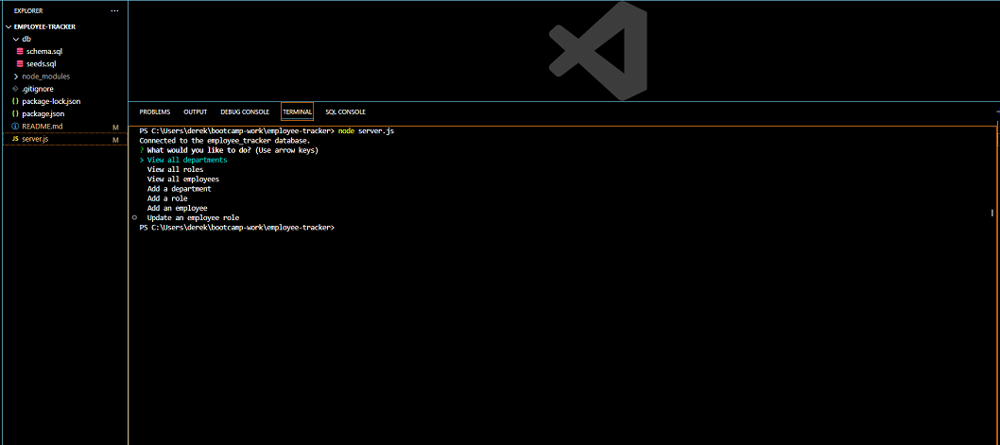

# E Commerce Database

## Description
This Node.js application facilitates the creation, reading, updating, and deleting of a database. It uses the third-party Node.js module called Sequelize to interact with a MySQL database. When the user makes hits to certain API the program will update the database in many ways. You can also use certain API to show the data that is in the database. I believe that this program shows what I have learned about databases and JavaScript.

## Table of Contents
  * [Installation](#installation)
  * [Usage](#usage)
  * [License](#license)
  * [Contribute](#contributions)
  * [Tests](#tests)
  * [Questions?](#questions)

## Installation
Once the repository is cloned, from the root directory of where they installed the application the user is to run the command 'npm install' to install required dependencies. After dependencies are loaded, the user must change the .env.EXAMPLE file to .env and fill in thier missing data. From there, create the database using MySQL in the db folder. Finally the user can seed the database by running the command "node seeds". Once the database is established, to run the program the user can run the command "node server.js".

## Usage
Click on the link below to see how to use the app on <a href="https://www.youtube.com/watch?v=BwE1Wh9z-Q8" target="_blank">YouTube</a>.

## License

## Contribute
Please feel free to contact me on my email or my github to contribute.

## Tests
No tests available at this time.

## Questions
Please reach out to me at derekmarchese1@gmail.com. 
Or check out my <a href="https://github.com/dtm589">GitHub</a>.